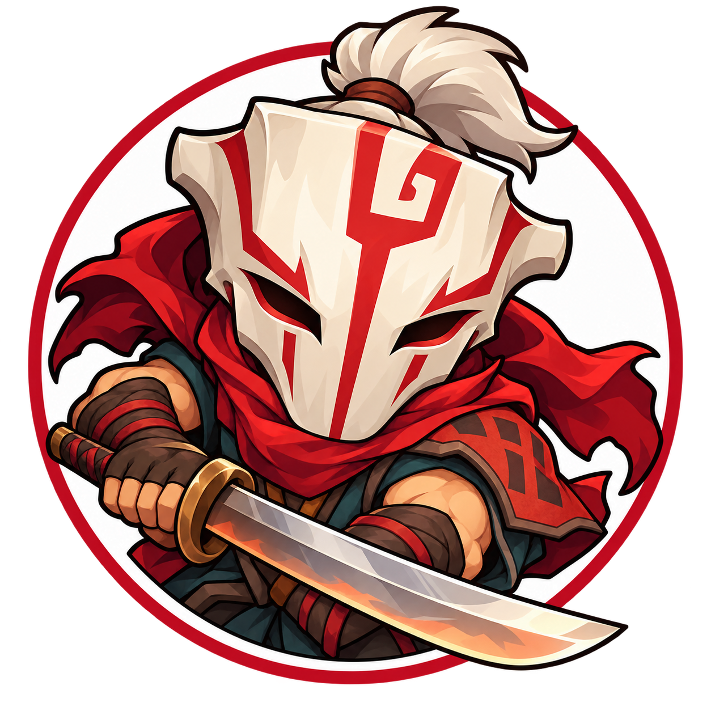
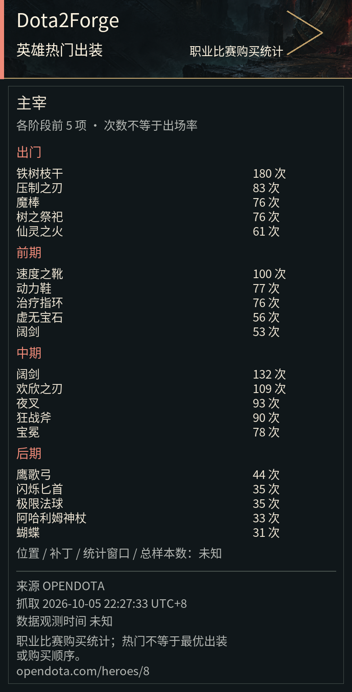

<p align="center">
  
</p>

<h1 align="center">Dota2Forge · AstrBot</h1>
<h4 align="center">在聊天里查刀塔战绩、比赛详情和英雄出装</h4>

<p align="center">AstrBot 插件 · Dota2Forge 共享核心 · Python 3.12+</p>

[安装文档](../../docs/cookbook/astrbot.md) · [截图清单](../../docs/cookbook/plugin-showcase.md) · [Dota2Forge](../../README.md) · [反馈问题](https://github.com/HBLADEH/Dota2Forge/issues)

<!-- distribution-release -->

## 丨安装提醒

> [!IMPORTANT]
> 插件标识为 `astrbot_plugin_dota2forge`，要求 **AstrBot >=4.5.0**、Python 3.12+。4.5.0 的公开 API 已核对；真实宿主测试目前在 4.28.2 完成。
> 当前为 **0.1.0-alpha.8 自动素材源码候选，尚未发布**。首次安装须按下方说明准备运行组件，再启动插件。

已有 OneBot 单会话基础查询、图片与宿主生命周期验收记录。2026-10-05 本机已升级匹配的 0.1.0a2 运行库和桥接，启用后为 `ready / image`，OneBot 已连接；现行 `do` 前缀、段位预估 MMR、英雄出装和新图标已部署。用户已提供完整主宰出装实机卡，命令输入未截入画面；新菜单、MMR 与其他现行指令截图仍待补充。订阅默认关闭，真实推送仍待验收；主动推送目前仅支持 OneBot v11 反向 WebSocket。

本候选实现首次后台素材准备及管理命令：Python适配器 `0.1.0a8`、Assets `0.1.0a1`、Core/Renderer `0.1.0a4`。已公开alpha.7依赖修复版不含此自动功能；本次尚未提交新商店版本或部署。

## 丨安装与首次配置

1. 停止 AstrBot，在它的根目录克隆插件：

   ```sh
   git clone https://github.com/HBLADEH/astrbot_plugin_dota2forge.git data/plugins/astrbot_plugin_dota2forge
   ```

2. 用 **AstrBot 实际使用的 Python** 运行插件里的安装器，Windows `.venv` 示例：

   ```sh
   .venv/Scripts/python.exe data/plugins/astrbot_plugin_dota2forge/install_runtime.py --host-python .venv/Scripts/python.exe
   ```

3. 重新启动 AstrBot，在插件配置中填写 `stratz_token` 和独立 `namespace`，保存后重新加载。Token 只填本机配置。完整步骤、Linux 路径及升级方式见[安装说明](../../docs/cookbook/astrbot-public-install.md)。

四个组件从本插件 GitHub Releases 下载，安装器核对版本与摘要，并检查依赖冲突。只在商店点击安装还不能直接使用。更新时同样需要退出宿主、运行安装器、重新启动；不会自动升级运行中的共享库。空 Token 提示等待配置，不启动业务请求。

## 丨快速开始

以下示例使用默认斜线唤醒前缀；若宿主配置了其他前缀，请对应替换：

```text
/do菜单
/do绑定 <Dota账号ID或SteamID64>
/do查询
/do战绩 20
/do战绩 第3页
/do比赛 第1场
/do主宰出装
```

`<…>` 表示替换为自己的值；方括号表示可省略。绑定只作用于发送者自己的平台身份，每个身份一个账号；查询其他账号不改变绑定，也不证明账号所有权。

## 丨指令列表

| 指令 | 功能 |
| --- | --- |
| `/do菜单` / `/do帮助` | 查看帮助图片 |
| `/do绑定 <ID>` / `/do改绑 <ID>` | 绑定自己 / 显式替换绑定 |
| `/do账号` / `/do解绑` | 查看绑定 / 解绑 |
| `/do查询 [ID]` / `/do段位 [ID]` | 玩家概况、段位与预估 MMR |
| `/do战绩 [条数]` | 自己的近期比赛，默认 10，范围 1–100 |
| `/do战绩 <ID> <条数>` | 查询指定账号 |
| `/do战绩 第N页` | 读取最后一次有效战绩的分页 |
| `/do比赛 <比赛ID>` / `/do比赛 第N场` | 单局详情 / 列表绝对序号选择 |
| `/do主宰出装` / `/doAM出装` / `/do出装 Shadow Fiend` | 无需绑定的英雄热门出装 |
| `/do素材状态` / `/do下载素材` / `/do更新素材` | 查看素材进度；下载、更新仅管理员 |
| `/do状态` / `/do停用` | 仅管理员；查看状态 / 关闭运行资源 |

账号接受规范 Dota account ID 或 SteamID64 数字，拒绝 URL、vanity、前导零和 @他人。比赛 ID 是独立参数。每页五场，最多先发两页；列表只在本会话完整发送后保存十分钟，改绑、解绑、停用与重载会清除它。

## 丨功能展示

### 帮助与账号绑定

`/do菜单` 展示入口；`/do绑定 <ID>` 后用 `/do账号` 核对。**待实机截图：菜单、绑定成功与账号卡。**

### 玩家与近期战绩

`/do查询` 展示段位、预估 MMR、统计和来源；`/do战绩 20` 配合 `/do战绩 第3页` 查看更多比赛。**待实机截图：玩家卡、战绩第 1 / 2 页及取页结果。**

### 单局详情

`/do比赛 第1场` 或直接传比赛 ID，按阵营展示英雄、装备与统计。**待实机截图：命令及天辉 / 夜魇两张详情卡。**

### 英雄热门出装

`/do主宰出装` 展示 OpenDota 职业比赛物品购买次数，按出门、前期、中期、后期分组，不能据此推断最优出装或购买顺序。以下为用户提供的 AstrBot 完整实机卡片，保留未知样本说明、来源与抓取时间；命令输入画面待补。



其余展示位等待现行 `do` 版本的脱敏截图。两端分别采集，保留唤醒前缀差异；文件名、画面内容与脱敏步骤见[截图清单](../../docs/cookbook/plugin-showcase.md)，已采用图片的范围与来源见[记录](../../docs/assets/screenshots/README.md)。

## 丨数据与使用说明

- 玩家 / 比赛默认来自 STRATZ，出装来自 OpenDota；来源、抓取时间、未知字段和请求失败分别显示。
- 预估 MMR 是段位区间或下界，**不是精确天梯分**；未定级和未知段位不估算。
- 默认图片；绘制失败回退同次数据的文字，发送失败不自动重发。
- 英雄 / 装备 / 段位图使用[托管或自定义本地素材](../../docs/cookbook/illustrations.md)，默认首次图片模式后台准备，完整快照不重复下载；缺图占位，普通回复不下载资源。自定义路径不覆盖，asset_download_mode 可设 manual/off。
- 玩家、指定比赛、段位与日报订阅见[指南](../../docs/cookbook/subscriptions.md)。默认关闭，群聊要求 Bot 管理员，主动推送只支持 OneBot v11 反向 WebSocket；双端部署须明确推送归属。

英雄攻略、AI Tool、IMP 和 Deploy 尚未实现。其他平台、多账号与当前版本完整实机边界仍待独立验收。

## 丨常见问题

**提示未配置？** 在插件配置填写 Token 与 namespace，保存后重载；不要把密钥发到聊天。

**命令没响应？** 检查 AstrBot 唤醒前缀、插件加载状态及实际安装版本；现行源码使用 `do`。

**找不到第 N 场？** 先在同一会话完整查战绩；超过十分钟或重载后重新查询，也可直接用比赛 ID。

**战绩有数据但英雄全是问号？** 商店包不含英雄、装备、段位图片。按[安装说明](../../docs/cookbook/astrbot-public-install.md)显式下载素材，并填写 `illustration_path` 后重载；Docker 要填写容器可见路径。素材与商店插件图标分别维护。

**如何更新或卸载？** 按[接入文档](../../docs/cookbook/astrbot.md)关闭运行资源、更新匹配库与桥接。卸载保留绑定 / 订阅数据，删除数据另行处理。

## 丨致谢与许可

README 结构参考 [GenshinUID](https://github.com/KimigaiiWuyi/GenshinUID)；图标呈现参考 [NTEUID](https://github.com/tyql688/NTEUID)，主宰图案为本项目独立生成的同人插画。感谢 AstrBot、STRATZ 和 OpenDota。

代码采用 [MIT](../../LICENSE)。Dota 2、主宰及相关角色权利属于 Valve；图标不是官方标识。字体与第三方素材各按原许可使用，见[素材说明](../../docs/cookbook/illustrations.md)。
